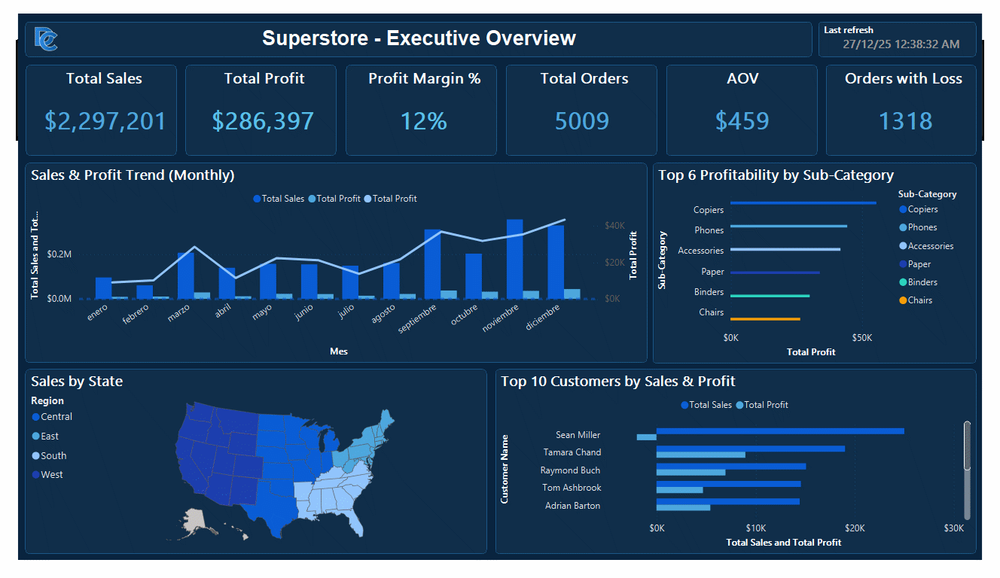
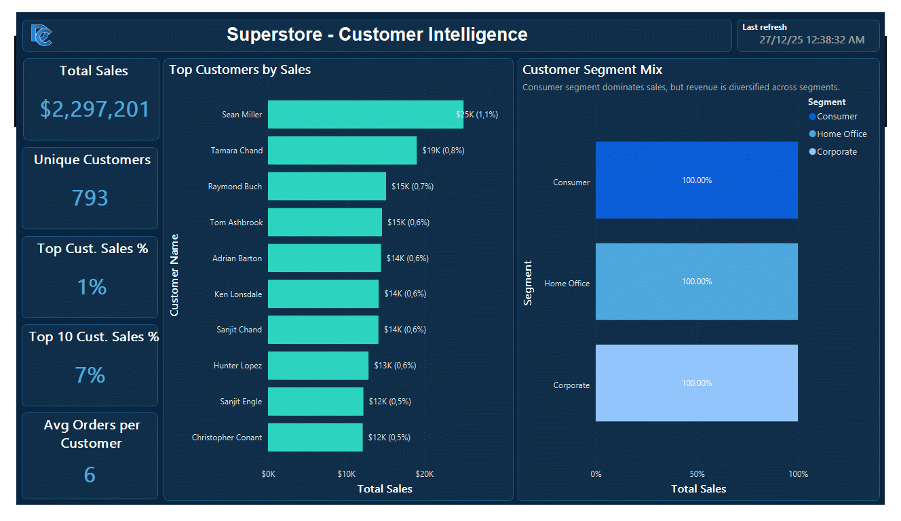
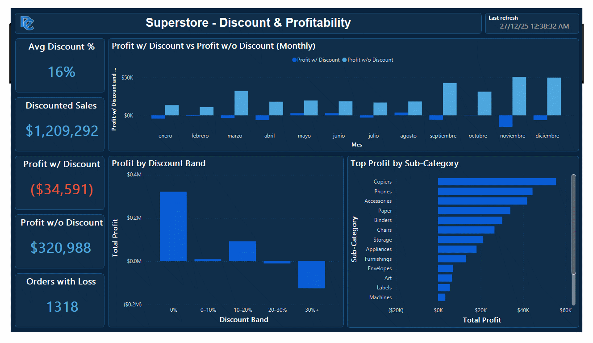
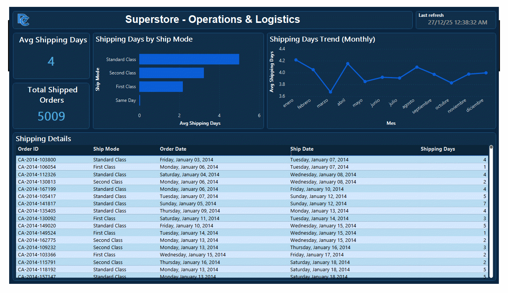
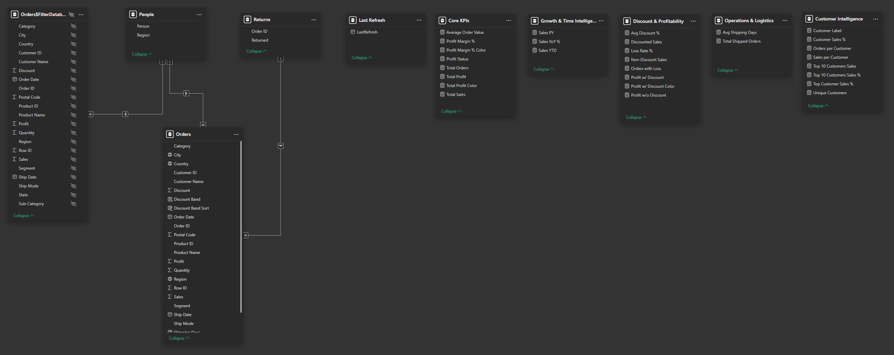

# 📊 Power BI - Superstore = Executive Business Intelligence Dashboard 

## 📌 Overview
This repository contains a **multi-page executive Business Intelligence dashboard** built in **Microsoft Power BI**, using the Superstore dataset.

The project is designed as a **portfolio-grade BI solution**, combining:
- Executive-level storytelling
- Strong analytical modeling
- Well-structured DAX measures
- Clear documentation for reproducibility and review

Because the Power BI tenant may expire, the dashboard is documented using **PDF exports and high-resolution screenshots** instead of live links.

---

## 🧭 Dashboard Structure

### Pages Included
1. **Executive Overview**
2. **Customer Intelligence**
3. **Discount & Profitability**
4. **Operations & Logistics**

Each page is designed around a **clear business question**, following enterprise BI best practices.

---

## 🖼 Dashboard Preview

### Executive Overview


### Customer Intelligence


### Discount & Profitability


### Operations & Logistics


---

## 📄 Full Dashboard (PDF)
📎 **[Download PDF](pdf/Power%20BI%20Dashboard%20-%20Superstore.pdf)**

## 📊 Full Dashboard (PBIX)
📎 **[Download PBIX](pdix/Power%20BI%20Dashboard%20-%20Superstore.pbix)**

---

## 🧱 Data Model
This project intentionally uses a **single-table analytical model**, as commonly done for lightweight Power BI portfolio projects.

### Model Diagram


---

## 🎯 Business KPIs

### Core Performance
- Total Sales
- Total Profit
- Profit Margin %
- Total Orders
- Average Order Value (AOV)
- Orders with Loss

### Customer Intelligence
- Unique Customers
- Orders per Customer
- Top Customer Sales %
- Top 10 Customers Sales %

### Discount & Profitability
- Discounted Sales
- Average Discount %
- Profit with Discount
- Profit without Discount
- Profit by Discount Band

### Operations & Logistics
- Average Shipping Days
- Shipping Days by Ship Mode
- Shipping Days Trend

---

## 🧮 Measures Documentation (DAX)

### Total Sales
```DAX
Total Sales =
SUM ( Orders[Sales] )
```

### Total Profit
```DAX
Total Profit =
SUM ( Orders[Profit] )
```

### Profit Margin %
```DAX
Profit Margin % =
DIVIDE ( [Total Profit], [Total Sales] )
```

### Total Orders
```DAX
Total Orders =
DISTINCTCOUNT ( Orders[Order ID] )
```

### Average Order Value (AOV)
```DAX
Average Order Value =
DIVIDE ( [Total Sales], [Total Orders] )
```

### Orders with Loss
```DAX
Orders with Loss =
CALCULATE (
    DISTINCTCOUNT ( Orders[Order ID] ),
    Orders[Profit] < 0
)
```

---

### Unique Customers
```DAX
Unique Customers =
DISTINCTCOUNT ( Orders[Customer Name] )
```

### Orders per Customer
```DAX
Orders per Customer =
DIVIDE ( [Total Orders], [Unique Customers] )
```

---

### Top Customer Sales %
```DAX
Top Customer Sales % =
DIVIDE (
    MAXX (
        VALUES ( Orders[Customer Name] ),
        [Total Sales]
    ),
    [Total Sales]
)
```

### Top 10 Customers Sales %
```DAX
Top 10 Customers Sales % =
DIVIDE (
    CALCULATE (
        [Total Sales],
        TOPN (
            10,
            VALUES ( Orders[Customer Name] ),
            [Total Sales],
            DESC
        )
    ),
    [Total Sales]
)
```

---

### Discounted Sales
```DAX
Discounted Sales =
CALCULATE (
    [Total Sales],
    Orders[Discount] > 0
)
```

### Average Discount %
```DAX
Avg Discount % =
AVERAGE ( Orders[Discount] )
```

---

### Profit with Discount
```DAX
Profit w/ Discount =
CALCULATE (
    [Total Profit],
    Orders[Discount] > 0
)
```

### Profit without Discount
```DAX
Profit w/o Discount =
CALCULATE (
    [Total Profit],
    Orders[Discount] = 0
)
```

---

### Discount Band
```DAX
Discount Band =
VAR d = Orders[Discount]
RETURN
SWITCH (
    TRUE(),
    d = 0, "0%",
    d > 0 && d <= 0.10, "0–10%",
    d > 0.10 && d <= 0.20, "10–20%",
    d > 0.20 && d <= 0.30, "20–30%",
    "30%+"
)
```

---

### Average Shipping Days
```DAX
Avg Shipping Days =
AVERAGE ( Orders[Shipping Days] )
```

---

## 🎛 Interaction & Design Principles
- KPIs act as context indicators, not filters
- Charts cross-filter each other
- Tables used for detailed inspection only
- Minimal slicers to avoid filter overload
- Consistent formatting across pages

---

## 🗂 Repository Structure
```
superstore/
│
├─ pbix/
│   └─ Power BI Dashboard - Superstore.pbix
│
├─ pdf/
│   └─ Power BI Dashboard - Superstore.pdf
│
├─ assets/
│   ├─ screenshots/
│   └─ diagrams/
│
└─ README.md
```

---

## 🎯 Purpose
This project demonstrates:
- Executive dashboard design
- Business-oriented analytics
- Strong DAX fundamentals
- Portfolio-quality BI documentation

